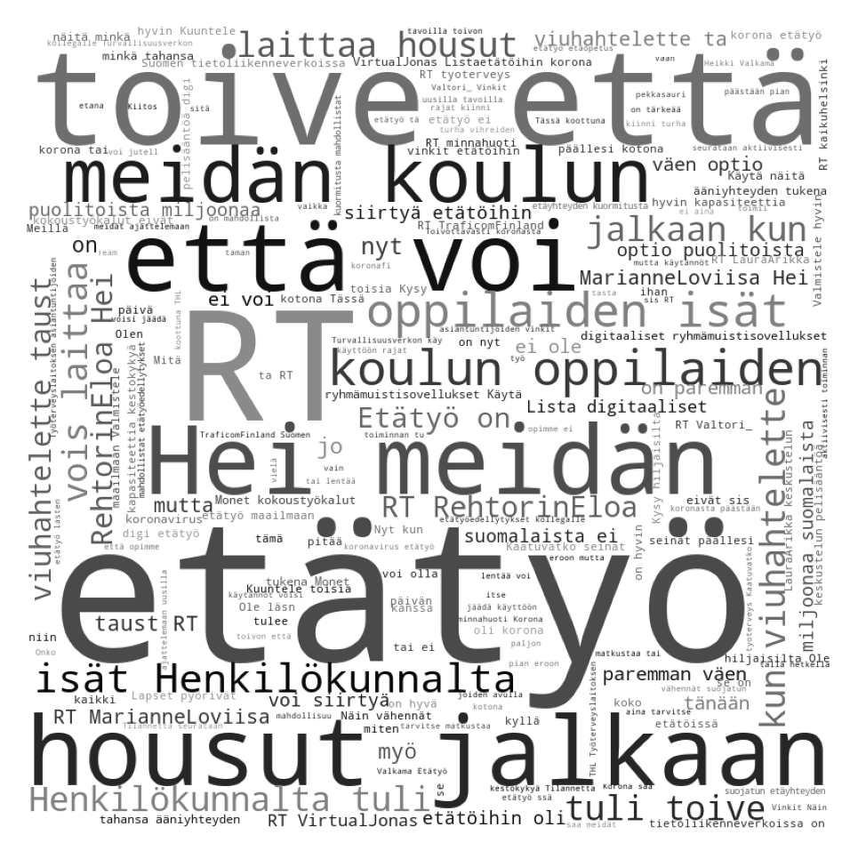

# Twitter etätyö

Tämä repo sisältää visualistointeja ja deskriptiivistä statistiikkaa [@jukkahuhtamaki](https://github.com/jukkahuhtamaki) keräämän etätyötä käsittelevän Twitter-aineiston osalta. Toistaiseksi hyvin luonnosvaiheessa, otan mielelläni vastaan kommentteja, kehitysehdotuksia ja työtä fokusoivia kysymyksenasetteluja.

Kansiorakenne noudattaa karkeasti cookiecutter datascience -rakennetta. 

## Interaktiivinen verkostotarkastelu
> Kesken

## Tilastot
> Kesken
### Hashtagien frekvenssit

## Sanapilvi
> Kesken

### TODO:
- [ ] toimijoiden verkostoanalyysi
- [ ] hashtagien yhteiskäyttö (co-occurence)
- [ ] aihemallinnus (topic modelling)
- [ ] perustilastot hashtageista
- [ ] sanapilvet
